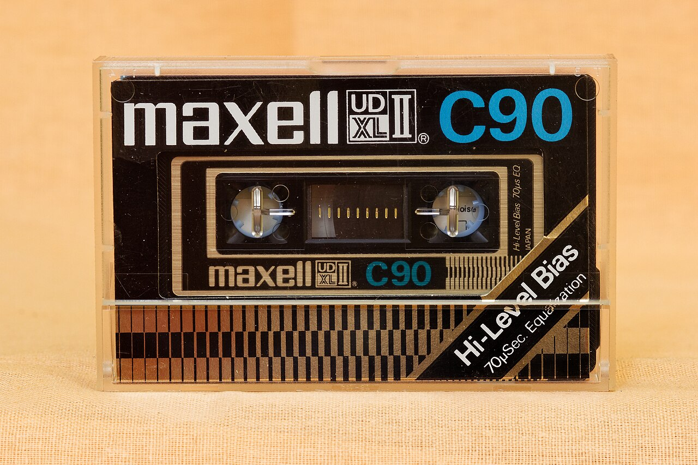

# Maxell UD C90

Maxell UD (Ultra Dynamic) C90 is a premium Type I normal bias cassette introduced in the 1970s.

## Sound Character

This tape has low background hiss and high signal headroom. It delivers a solid bass boost with strong low-end punch around 150 Hz.

High frequencies are clear, with only a gentle treble roll-off. Motor speed is very stable, so pitch fluctuations are minimal. It is one of the best-sounding normal bias tapes for dynamic rock and acoustic music.
