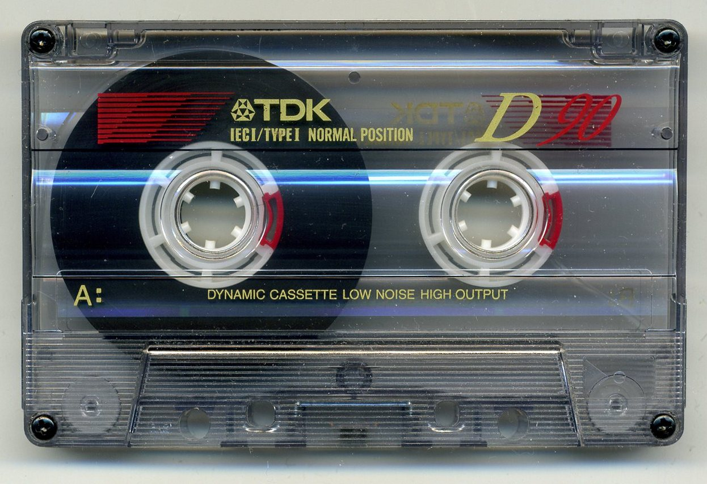

# TDK D90 (1995-1997)

TDK D90 was the most widely used Type I cassette tape in the world during the late 1990s.

## Sound Character

By the mid-1990s, ferric tape technology reached its peak. This tape has quiet background hiss and wide frequency response up to 14.5 kHz.

It features a crisp presence boost around 3 kHz that makes vocals pop. Wow and flutter are almost imperceptible. It sounds clean, balanced, and reliable, with just a hint of tape warmth.
