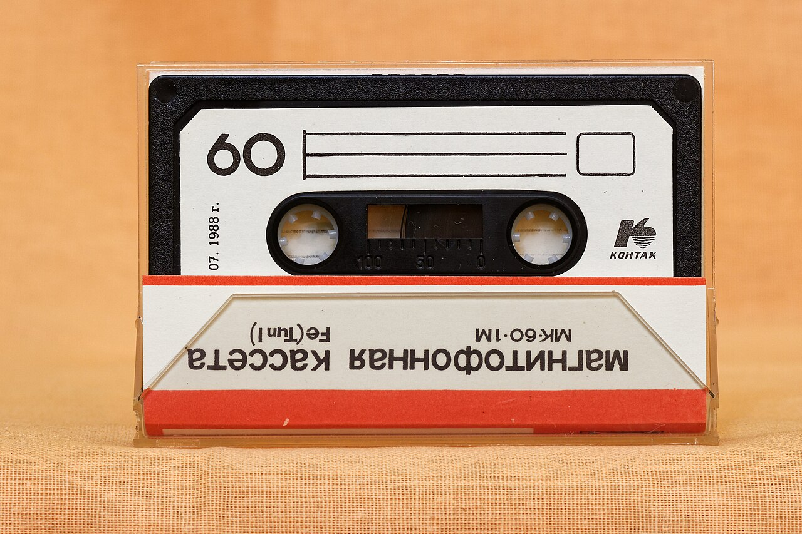

# МК-60 (MK-60)

The MK-60 was the standard Soviet cassette tape produced from the late 1970s through the 1990s across various USSR factories.

## Sound Character

This tape sounds raw, gritty, and heavily degraded.

It features very high background tape hiss and severe pitch wobble from uneven tape winding. The frequency response is narrow, choking off treble above 9 kHz and boosting muddy mid frequencies at 400 Hz. It sounds like an old bootleg recorded off a cheap Soviet boombox.
